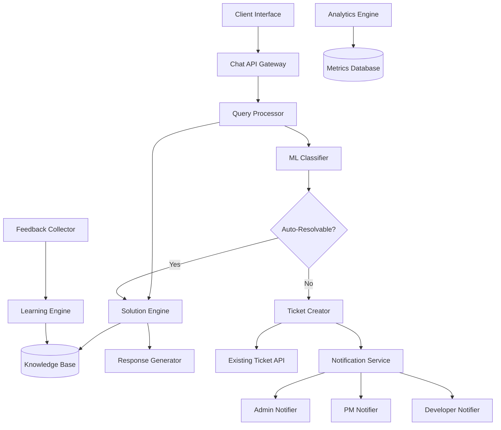

# Design Document

## Overview

The Intelligent AI Support Assistant is a sophisticated chatbot system that leverages natural language processing and machine learning to automatically resolve 80% of client queries while intelligently escalating the remaining 20% to human developers. The system integrates seamlessly with the existing RBAC ticketing infrastructure and provides comprehensive analytics and learning capabilities.

## Architecture

The system follows a microservices architecture with the following key components:



## Components and Interfaces

### 1. Chat API Gateway

**Purpose:** Entry point for all client interactions with the AI assistant.

**Interface:**
```typescript
interface ChatAPIGateway {
  sendMessage(userId: number, message: string, conversationId?: string): Promise<ChatResponse>
  getConversationHistory(conversationId: string): Promise<ConversationHistory>
  provideFeedback(conversationId: string, messageId: string, rating: number, comments?: string): Promise<void>
}

interface ChatResponse {
  messageId: string
  conversationId: string
  response: string
  responseType: 'solution' | 'clarification' | 'ticket_created'
  ticketId?: number
  confidence: number
  suggestedActions?: string[]
}
```

### 2. Query Processor

**Purpose:** Orchestrates the analysis and processing of incoming queries.

**Interface:**
```typescript
interface QueryProcessor {
  processQuery(query: QueryInput): Promise<ProcessingResult>
  analyzeIntent(message: string): Promise<IntentAnalysis>
  extractEntities(message: string): Promise<EntityExtraction>
}

interface QueryInput {
  userId: number
  message: string
  conversationHistory: ConversationMessage[]
  userContext: UserContext
}

interface ProcessingResult {
  classification: QueryClassification
  suggestedSolution?: Solution
  ticketData?: TicketCreationData
  confidence: number
}
```

### 3. ML Classifier

**Purpose:** Determines whether queries can be auto-resolved or require developer intervention.

**Interface:**
```typescript
interface MLClassifier {
  classifyQuery(query: string, context: QueryContext): Promise<Classification>
  updateModel(trainingData: TrainingExample[]): Promise<void>
  getModelMetrics(): Promise<ModelMetrics>
}

interface Classification {
  category: 'auto_resolvable' | 'requires_developer'
  confidence: number
  reasoning: string[]
  suggestedPriority?: TicketPriority
}

interface QueryContext {
  userRole: string
  previousQueries: string[]
  technicalKeywords: string[]
  urgencyIndicators: string[]
}
```

### 4. Solution Engine

**Purpose:** Generates comprehensive solutions for auto-resolvable queries.

**Interface:**
```typescript
interface SolutionEngine {
  generateSolution(query: string, classification: Classification): Promise<Solution>
  searchKnowledgeBase(keywords: string[]): Promise<KnowledgeEntry[]>
  validateSolution(solution: Solution, query: string): Promise<ValidationResult>
}

interface Solution {
  id: string
  title: string
  steps: SolutionStep[]
  additionalResources: Resource[]
  estimatedTime: number
  difficulty: 'easy' | 'medium' | 'advanced'
  tags: string[]
}

interface SolutionStep {
  stepNumber: number
  instruction: string
  codeExample?: string
  expectedResult?: string
  troubleshooting?: string[]
}
```

### 5. Ticket Creator

**Purpose:** Automatically creates support tickets for complex queries requiring developer intervention.

**Interface:**
```typescript
interface TicketCreator {
  createTicket(ticketData: AutoTicketData): Promise<TicketCreationResult>
  enrichTicketData(query: string, analysis: IntentAnalysis): Promise<EnrichedTicketData>
  determinePriority(query: string, urgencyIndicators: string[]): Promise<TicketPriority>
}

interface AutoTicketData {
  clientId: number
  query: string
  conversationHistory: ConversationMessage[]
  aiAnalysis: string
  suggestedPriority: TicketPriority
  category: string
  tags: string[]
}

interface TicketCreationResult {
  ticketId: number
  assignedTo?: number
  estimatedResolutionTime?: number
  notificationsSent: NotificationResult[]
}
```

### 6. Notification Service

**Purpose:** Manages all notifications for ticket creation, assignment, and escalation.

**Interface:**
```typescript
interface NotificationService {
  notifyTicketCreated(ticket: Ticket): Promise<NotificationResult[]>
  notifyTicketAssigned(ticket: Ticket, developerId: number, assignedBy: number): Promise<NotificationResult[]>
  notifyTicketEscalated(ticket: Ticket, reason: string, escalatedBy: number): Promise<NotificationResult[]>
  notifyTicketCanceled(ticket: Ticket, reason: string, canceledBy: number): Promise<NotificationResult[]>
}

interface NotificationResult {
  recipientId: number
  recipientType: 'admin' | 'pm' | 'developer' | 'client'
  channel: 'in_app' | 'email'
  status: 'sent' | 'failed' | 'pending'
  timestamp: Date
}
```

## Data Models

### Knowledge Base Schema

```typescript
interface KnowledgeEntry {
  id: string
  title: string
  content: string
  category: string
  tags: string[]
  difficulty: 'beginner' | 'intermediate' | 'advanced'
  successRate: number
  lastUpdated: Date
  createdBy: 'ai' | 'human'
  sourceTickets: number[]
  relatedEntries: string[]
}

interface SolutionPattern {
  id: string
  queryPattern: string
  solutionTemplate: string
  variables: PatternVariable[]
  successCount: number
  failureCount: number
  confidence: number
}
```

### Analytics Schema

```typescript
interface QueryMetrics {
  id: string
  timestamp: Date
  userId: number
  query: string
  classification: string
  confidence: number
  resolutionType: 'auto_resolved' | 'ticket_created' | 'escalated'
  resolutionTime: number
  userSatisfaction?: number
  ticketId?: number
}

interface SystemPerformance {
  date: Date
  totalQueries: number
  autoResolvedQueries: number
  ticketsCreated: number
  averageConfidence: number
  averageSatisfaction: number
  classificationAccuracy: number
}
```

### Enhanced Ticket Schema

```typescript
interface EnhancedTicket extends Ticket {
  aiGenerated: boolean
  aiAnalysis?: string
  originalQuery: string
  conversationHistory: ConversationMessage[]
  autoClassification: string
  confidenceScore: number
  escalationHistory: EscalationRecord[]
}

interface EscalationRecord {
  id: string
  ticketId: number
  action: 'passed' | 'canceled' | 'reassigned'
  performedBy: number
  reason: string
  timestamp: Date
  previousAssignee?: number
  newAssignee?: number
}
```

## Correctness Properties

*A property is a characteristic or behavior that should hold true across all valid executions of a system-essentially, a formal statement about what the system should do. Properties serve as the bridge between human-readable specifications and machine-verifiable correctness guarantees.*

### Property 1: Query Classification Accuracy
*For any* client query, the ML classifier should achieve at least 80% accuracy in determining whether the query can be auto-resolved or requires developer intervention
**Validates: Requirements 2.2**

### Property 2: Automatic Ticket Creation Completeness
*For any* query classified as "requires-developer", the system should automatically create a complete ticket with all required fields populated
**Validates: Requirements 3.1, 3.2, 3.3**

### Property 3: Notification Delivery Consistency
*For any* automatically created ticket, the system should notify all relevant stakeholders (admins and assigned PM) without failure
**Validates: Requirements 4.1, 4.2**

### Property 4: Developer Assignment Notification
*For any* ticket assignment by admin or PM, the assigned developer and the assigning user should receive notifications
**Validates: Requirements 5.1, 5.2, 5.3**

### Property 5: Escalation Reason Requirement
*For any* ticket escalation (pass or cancel), the developer must provide a non-empty reason before the action can be completed
**Validates: Requirements 6.3**

### Property 6: Solution Database Consistency
*For any* successful AI resolution, the solution pattern should be recorded in the knowledge base for future reference
**Validates: Requirements 7.2**

### Property 7: Performance Metrics Accuracy
*For any* time period, the calculated percentage of auto-resolved queries should equal the actual count of auto-resolved queries divided by total queries
**Validates: Requirements 8.1**

### Property 8: Feedback Collection Completeness
*For any* AI-provided solution, the system should request and store client feedback for continuous improvement
**Validates: Requirements 9.1, 9.3**

### Property 9: Integration Transparency
*For any* AI-created ticket, it should be indistinguishable from manually created tickets in terms of workflow and properties
**Validates: Requirements 10.2, 10.3**

### Property 10: Conversation Context Preservation
*For any* multi-turn conversation, the AI should maintain context from previous messages to provide coherent responses
**Validates: Requirements 1.4**

## Error Handling

### Classification Errors
- **Low Confidence Classifications:** When classifier confidence < 70%, escalate to human review
- **Ambiguous Queries:** Request clarification from client before proceeding
- **Model Failures:** Fallback to rule-based classification system

### Ticket Creation Failures
- **API Failures:** Retry with exponential backoff, notify admins if persistent
- **Data Validation Errors:** Log error details and request manual ticket creation
- **Notification Failures:** Queue notifications for retry, maintain delivery status

### Solution Generation Errors
- **Knowledge Base Unavailable:** Use cached solutions or fallback responses
- **Invalid Solutions:** Validate solutions before delivery, flag for review
- **Timeout Errors:** Provide partial solutions with option to create ticket

### Integration Failures
- **Database Connectivity:** Implement circuit breaker pattern with graceful degradation
- **External API Failures:** Maintain service availability with reduced functionality
- **Authentication Errors:** Clear error messages with recovery instructions

## Testing Strategy

### Unit Testing
- Test individual components (classifier, solution engine, ticket creator) with mock data
- Validate API endpoints with various input scenarios
- Test error handling and edge cases for each component
- Verify notification delivery mechanisms

### Property-Based Testing
- Generate random queries to test classification consistency
- Test ticket creation with various query types and user contexts
- Validate notification delivery across different user roles and scenarios
- Test solution generation with diverse query patterns

### Integration Testing
- Test end-to-end query processing workflows
- Validate integration with existing ticket system
- Test notification workflows across all user types
- Verify analytics data collection and reporting

### Performance Testing
- Load testing with concurrent users and high query volumes
- Response time testing for real-time chat interactions
- Database performance testing with large knowledge bases
- Scalability testing for notification systems

### Machine Learning Testing
- Cross-validation testing for classification model accuracy
- A/B testing for solution effectiveness
- Continuous monitoring of model drift and performance degradation
- Feedback loop testing for learning system improvements