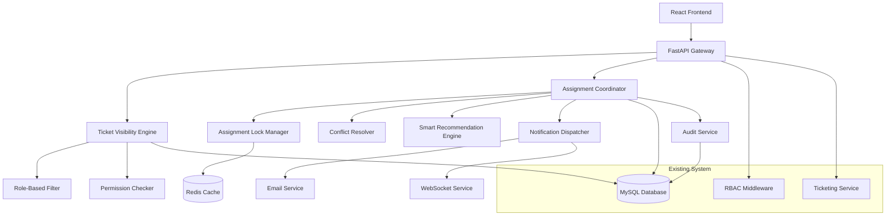

# Design Document

## Overview

The Ticket Visibility and Assignment Management system enhances the existing RBAC ticketing infrastructure by ensuring proper ticket visibility in the "Active Tickets" section and implementing conflict-free assignment workflows. After ticket creation, tickets become visible to admins, project managers, and developers in the Active Tickets view, where both admins and PMs can assign tickets to developers, and developers can self-assign unassigned tickets.

## Architecture

The system extends the existing microservices architecture with new components for visibility control and assignment coordination:



## Components and Interfaces

### 1. Ticket Visibility Engine

**Purpose:** Controls which tickets are visible to which users based on role-based rules and permissions.

**Interface:**
```typescript
interface TicketVisibilityEngine {
  getVisibleTickets(userId: number, userRole: string, filters?: TicketFilters): Promise<Ticket[]>
  checkTicketAccess(userId: number, ticketId: number, action: string): Promise<boolean>
  applyRoleBasedFiltering(tickets: Ticket[], userRole: string, userId: number): Ticket[]
}

interface TicketFilters {
  status?: TicketStatus[]
  priority?: TicketPriority[]
  assignedTo?: number[]
  dateRange?: DateRange
  searchQuery?: string
}

interface VisibilityRules {
  client: {
    canSee: ['own_tickets']
    cannotSee: ['other_client_tickets', 'internal_notes']
  }
  developer: {
    canSee: ['assigned_tickets', 'unassigned_tickets', 'self_assignable']
    cannotSee: ['other_developer_private_notes']
  }
  project_manager: {
    canSee: ['team_tickets', 'unassigned_tickets', 'all_open_tickets']
    cannotSee: ['admin_only_tickets']
  }
  admin: {
    canSee: ['all_tickets']
    cannotSee: []
  }
}
```

### 2. Assignment Coordinator

**Purpose:** Manages ticket assignment workflows, prevents conflicts, and coordinates between different user roles.

**Interface:**
```typescript
interface AssignmentCoordinator {
  initiateAssignment(ticketId: number, assignerId: number, assigneeId: number): Promise<AssignmentResult>
  checkAssignmentPermissions(assignerId: number, ticketId: number): Promise<PermissionResult>
  resolveAssignmentConflict(conflictData: AssignmentConflict): Promise<ConflictResolution>
  bulkAssign(assignments: BulkAssignmentRequest): Promise<BulkAssignmentResult>
}

interface AssignmentResult {
  success: boolean
  assignmentId: string
  lockAcquired: boolean
  conflictDetected: boolean
  notificationsSent: NotificationResult[]
  errorMessage?: string
}

interface AssignmentConflict {
  ticketId: number
  conflictingAssigners: AssignmentAttempt[]
  timestamp: Date
  resolutionStrategy: 'admin_priority' | 'first_come_first_serve' | 'manual_review'
}
```

### 3. Assignment Lock Manager

**Purpose:** Prevents simultaneous assignment conflicts using distributed locking with Redis.

**Interface:**
```typescript
interface AssignmentLockManager {
  acquireLock(ticketId: number, userId: number, duration: number): Promise<LockResult>
  releaseLock(ticketId: number, userId: number): Promise<boolean>
  checkLockStatus(ticketId: number): Promise<LockStatus>
  extendLock(ticketId: number, userId: number, additionalTime: number): Promise<boolean>
}

interface LockResult {
  acquired: boolean
  lockId: string
  expiresAt: Date
  currentHolder?: number
  waitTime?: number
}

interface LockStatus {
  isLocked: boolean
  lockedBy?: number
  lockedByName?: string
  expiresAt?: Date
  lockDuration: number
}
```

### 4. Smart Recommendation Engine

**Purpose:** Provides intelligent assignment recommendations based on workload, expertise, and performance history.

**Interface:**
```typescript
interface SmartRecommendationEngine {
  getAssignmentRecommendations(ticketId: number): Promise<DeveloperRecommendation[]>
  calculateWorkloadScore(developerId: number): Promise<WorkloadScore>
  analyzeTicketComplexity(ticketId: number): Promise<ComplexityAnalysis>
  getOptimalAssignment(ticketId: number, availableDevelopers: number[]): Promise<OptimalAssignment>
}

interface DeveloperRecommendation {
  developerId: number
  developerName: string
  score: number
  reasoning: string[]
  currentWorkload: number
  estimatedCompletionTime: number
  expertiseMatch: number
  availabilityScore: number
}

interface WorkloadScore {
  activeTickets: number
  totalPoints: number
  capacityUtilization: number
  averageCompletionTime: number
  recentPerformance: number
}
```

### 5. Enhanced Notification Dispatcher

**Purpose:** Manages real-time notifications for assignment events with multiple delivery channels.

**Interface:**
```typescript
interface NotificationDispatcher {
  sendAssignmentNotification(assignment: Assignment): Promise<NotificationResult[]>
  sendConflictNotification(conflict: AssignmentConflict): Promise<NotificationResult[]>
  sendBulkAssignmentNotification(bulkResult: BulkAssignmentResult): Promise<NotificationResult[]>
  subscribeToAssignmentEvents(userId: number, callback: NotificationCallback): void
}

interface NotificationResult {
  recipientId: number
  channel: 'email' | 'websocket' | 'in_app'
  status: 'sent' | 'failed' | 'pending' | 'delivered'
  timestamp: Date
  messageId: string
  errorMessage?: string
}

interface NotificationTemplate {
  type: 'assignment' | 'conflict' | 'bulk_assignment' | 'lock_override'
  subject: string
  bodyTemplate: string
  priority: 'low' | 'medium' | 'high' | 'urgent'
  channels: NotificationChannel[]
}
```

## Data Models

### Enhanced Ticket Schema

```typescript
interface EnhancedTicket extends Ticket {
  // Visibility metadata
  visibilityLevel: 'public' | 'team' | 'admin_only'
  accessControlList: number[]
  
  // Assignment metadata
  assignmentHistory: AssignmentRecord[]
  assignmentLockStatus?: LockStatus
  assignmentRecommendations?: DeveloperRecommendation[]
  
  // Conflict tracking
  assignmentConflicts: AssignmentConflict[]
  lastAssignmentAttempt?: Date
  assignmentAttemptCount: number
}

interface AssignmentRecord {
  id: string
  ticketId: number
  assignerId: number
  assignerName: string
  assignerRole: string
  assigneeId: number
  assigneeName: string
  assignedAt: Date
  unassignedAt?: Date
  reason: string
  notes?: string
  wasConflicted: boolean
  overrodeConflict: boolean
}
```

### Assignment Lock Schema

```sql
CREATE TABLE assignment_locks (
  id VARCHAR(255) PRIMARY KEY,
  ticket_id INT NOT NULL,
  locked_by INT NOT NULL,
  locked_by_name VARCHAR(255) NOT NULL,
  locked_by_role ENUM('admin', 'project_manager') NOT NULL,
  locked_at TIMESTAMP DEFAULT CURRENT_TIMESTAMP,
  expires_at TIMESTAMP NOT NULL,
  lock_duration INT NOT NULL,
  is_active BOOLEAN DEFAULT TRUE,
  
  FOREIGN KEY (ticket_id) REFERENCES tickets(id),
  FOREIGN KEY (locked_by) REFERENCES users(id),
  INDEX idx_ticket_active (ticket_id, is_active),
  INDEX idx_expires_at (expires_at)
);
```

### Assignment History Schema

```sql
CREATE TABLE assignment_history (
  id VARCHAR(255) PRIMARY KEY,
  ticket_id INT NOT NULL,
  assigner_id INT NOT NULL,
  assigner_role ENUM('admin', 'project_manager', 'developer') NOT NULL,
  assignee_id INT NOT NULL,
  assigned_at TIMESTAMP DEFAULT CURRENT_TIMESTAMP,
  unassigned_at TIMESTAMP NULL,
  assignment_reason TEXT,
  assignment_notes TEXT,
  was_conflicted BOOLEAN DEFAULT FALSE,
  overrode_conflict BOOLEAN DEFAULT FALSE,
  
  FOREIGN KEY (ticket_id) REFERENCES tickets(id),
  FOREIGN KEY (assigner_id) REFERENCES users(id),
  FOREIGN KEY (assignee_id) REFERENCES users(id),
  INDEX idx_ticket_history (ticket_id, assigned_at),
  INDEX idx_assignee_history (assignee_id, assigned_at)
);
```

### Assignment Conflicts Schema

```sql
CREATE TABLE assignment_conflicts (
  id VARCHAR(255) PRIMARY KEY,
  ticket_id INT NOT NULL,
  conflict_detected_at TIMESTAMP DEFAULT CURRENT_TIMESTAMP,
  resolution_strategy ENUM('admin_priority', 'first_come_first_serve', 'manual_review') NOT NULL,
  resolved_at TIMESTAMP NULL,
  resolved_by INT NULL,
  resolution_notes TEXT,
  
  FOREIGN KEY (ticket_id) REFERENCES tickets(id),
  FOREIGN KEY (resolved_by) REFERENCES users(id),
  INDEX idx_ticket_conflicts (ticket_id, conflict_detected_at)
);

CREATE TABLE assignment_conflict_attempts (
  id VARCHAR(255) PRIMARY KEY,
  conflict_id VARCHAR(255) NOT NULL,
  attempter_id INT NOT NULL,
  attempter_role ENUM('admin', 'project_manager') NOT NULL,
  attempted_assignee_id INT NOT NULL,
  attempt_timestamp TIMESTAMP DEFAULT CURRENT_TIMESTAMP,
  was_successful BOOLEAN DEFAULT FALSE,
  
  FOREIGN KEY (conflict_id) REFERENCES assignment_conflicts(id),
  FOREIGN KEY (attempter_id) REFERENCES users(id),
  FOREIGN KEY (attempted_assignee_id) REFERENCES users(id)
);
```

Now I need to use the prework tool to analyze the acceptance criteria before writing the correctness properties:

<function_calls>
<invoke name="prework">
<parameter name="featureName">ticket-visibility-assignment

## Correctness Properties

*A property is a characteristic or behavior that should hold true across all valid executions of a system-essentially, a formal statement about what the system should do. Properties serve as the bridge between human-readable specifications and machine-verifiable correctness guarantees.*

### Property 1: Client Ticket Isolation
*For any* client user, the ticket visibility engine should only return tickets created by that specific client, never tickets from other clients
**Validates: Requirements 1.1**

### Property 2: Active Tickets Visibility for Staff
*For any* admin, project manager, or developer, the ticket visibility engine should return all active (open and in-progress) tickets in the system
**Validates: Requirements 1.2, 1.3, 1.4, 1.5**

### Property 3: Dual Assignment Authority
*For any* unassigned ticket, both admins and project managers should be able to successfully assign it to any available developer
**Validates: Requirements 2.1**

### Property 4: Developer Self-Assignment
*For any* unassigned ticket, developers should be able to successfully self-assign the ticket
**Validates: Requirements 2.2**

### Property 5: Assignment Prevention on Assigned Tickets
*For any* already assigned ticket, further assignment attempts should be rejected until the ticket is unassigned
**Validates: Requirements 2.3**

### Property 6: Concurrent Assignment Prevention
*For any* ticket being assigned simultaneously by multiple users, only one assignment should succeed while others receive appropriate conflict notifications
**Validates: Requirements 2.4**

### Property 7: Assignment Lock Duration
*For any* assignment lock created, the lock should automatically expire after exactly 5 minutes unless explicitly released earlier
**Validates: Requirements 3.1, 3.3**

### Property 8: Lock Information Visibility
*For any* active assignment lock, other users attempting to assign the same ticket should see the lock holder's name and expiration time
**Validates: Requirements 3.2, 3.5**

### Property 9: Assignment Notification Timing
*For any* successful ticket assignment, the assigned developer should receive a notification within 30 seconds of the assignment
**Validates: Requirements 4.1**

### Property 10: Multi-Channel Notification Delivery
*For any* assignment event, notifications should be sent through both in-app and email channels simultaneously
**Validates: Requirements 4.5**

### Property 11: Assignment Audit Completeness
*For any* assignment action, the system should record timestamp, assigner ID, assignee ID, and reason in the assignment history
**Validates: Requirements 5.1**

### Property 12: Workload-Based Recommendations
*For any* assignment recommendation request, developers with lower current workload should be ranked higher in the recommendation list
**Validates: Requirements 6.2**

### Property 13: Bulk Assignment Distribution
*For any* bulk assignment operation, tickets should be distributed as evenly as possible across the selected developers
**Validates: Requirements 7.2**

### Property 14: Bulk Assignment Validation
*For any* bulk assignment request, all tickets should be validated as assignable before any assignments are executed
**Validates: Requirements 7.3**

### Property 15: Integration Compatibility
*For any* existing ticket workflow, the assignment system should not modify or interfere with existing ticket status transitions
**Validates: Requirements 8.1, 8.3**

### Property 16: Performance Under Load
*For any* system load up to 100 concurrent users, ticket visibility operations should complete within 2 seconds
**Validates: Requirements 1.5, 9.1**

### Property 17: Assignment Processing Performance
*For any* assignment operation, 95% of requests should complete within 1 second under normal system load
**Validates: Requirements 9.2**

### Property 18: Lock Integrity Under Concurrency
*For any* concurrent assignment attempts on the same ticket, only one lock should be successfully acquired, preventing race conditions
**Validates: Requirements 9.3**

## Error Handling

### Visibility Engine Errors
- **Database Connection Failures:** Implement circuit breaker pattern with cached ticket data fallback
- **Permission Calculation Errors:** Log errors and default to most restrictive permissions for security
- **Large Dataset Performance:** Implement pagination and lazy loading for ticket lists exceeding 1000 items

### Assignment Coordinator Errors
- **Lock Acquisition Failures:** Retry with exponential backoff up to 3 attempts, then queue for later processing
- **Conflict Resolution Errors:** Escalate to admin review queue with detailed conflict information
- **Notification Delivery Failures:** Queue failed notifications for retry with different delivery channels

### Lock Manager Errors
- **Redis Connection Failures:** Fallback to database-based locking with reduced performance
- **Lock Expiration Race Conditions:** Implement atomic lock operations with proper cleanup
- **Distributed Lock Inconsistencies:** Regular lock cleanup job to remove orphaned locks

### Integration Errors
- **Existing API Compatibility:** Maintain backward compatibility with graceful degradation
- **Database Schema Migration Errors:** Rollback capability with data integrity checks
- **Real-time Notification Failures:** Store notifications for later delivery when connections restore

## Testing Strategy

### Unit Testing
- Test individual components (visibility engine, assignment coordinator, lock manager) with mock dependencies
- Validate role-based filtering logic with comprehensive permission matrices
- Test assignment conflict resolution algorithms with various scenarios
- Verify notification delivery mechanisms across different channels

### Property-Based Testing
- Generate random user roles and ticket assignments to test visibility rules
- Test assignment operations with concurrent users and various conflict scenarios
- Validate lock management with random timing and expiration scenarios
- Test bulk operations with varying ticket counts and developer availability

### Integration Testing
- Test end-to-end assignment workflows across all user roles
- Validate integration with existing RBAC and ticketing systems
- Test real-time notification delivery through WebSocket and email channels
- Verify database consistency during high-concurrency assignment operations

### Performance Testing
- Load testing with 100+ concurrent users accessing ticket visibility
- Stress testing assignment operations under high concurrent load
- Memory and CPU profiling for lock management operations
- Database query optimization testing for complex visibility rules

### Security Testing
- Test role-based access controls with privilege escalation attempts
- Validate assignment authority enforcement under various attack scenarios
- Test lock bypass attempts and unauthorized assignment operations
- Verify audit trail integrity and tamper resistance