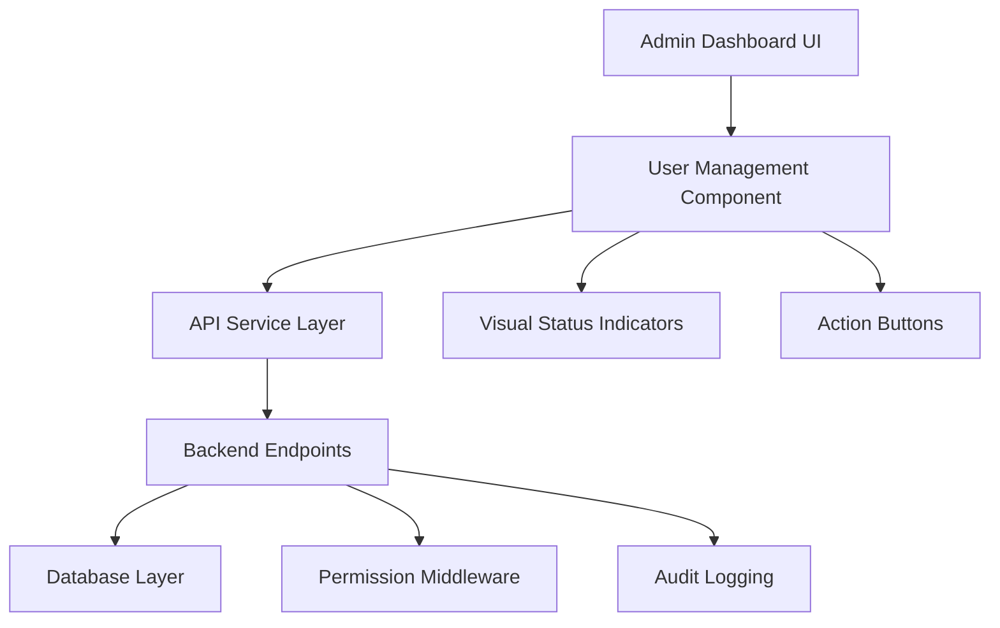

# Design Document

## Overview

The User Management Actions feature enhances the admin dashboard's user management table by adding activation/deactivation controls with visual status indicators. This design provides a comprehensive solution for managing user access through an intuitive interface with proper security controls and visual feedback.

## Architecture

The feature follows a client-server architecture with clear separation between presentation, business logic, and data layers:



## Components and Interfaces

### Frontend Components

#### Enhanced User Management Table
- **Location**: `app/dashboard/admin/page.tsx` (Users Overview section)
- **Purpose**: Display users with action controls and status indicators
- **Key Features**:
  - Action column with conditional button rendering
  - Visual styling for inactive users
  - Loading states during operations
  - Error handling and feedback

#### User Action Buttons Component
```typescript
interface UserActionButtonsProps {
  user: User
  currentUserId: number
  onActivate: (userId: number) => Promise<void>
  onDeactivate: (userId: number) => Promise<void>
  isLoading: boolean
}
```

#### Visual Status Indicators
- **Inactive User Styling**: 
  - Opacity: 0.6
  - Background: subtle gray overlay
  - Text color: muted
  - Consistent across all table cells

### Backend Endpoints

#### User Activation Endpoint
```
POST /admin/users/{user_id}/activate
Authorization: Bearer <admin_token>
Response: { "user": User, "message": "User activated successfully" }
```

#### User Deactivation Endpoint
```
POST /admin/users/{user_id}/deactivate
Authorization: Bearer <admin_token>
Response: { "user": User, "message": "User deactivated successfully" }
```

## Data Models

### User Model Enhancement
```typescript
interface User {
  id: number
  username: string
  email: string
  role: UserRole
  createdAt: string
  lastLogin: string | null
  isActive: boolean // Key field for activation status
}
```

### API Response Models
```typescript
interface UserActionResponse {
  user: User
  message: string
  success: boolean
}

interface UserActionError {
  error: string
  code: number
  details?: string
}
```

## Correctness Properties

*A property is a characteristic or behavior that should hold true across all valid executions of a system-essentially, a formal statement about what the system should do. Properties serve as the bridge between human-readable specifications and machine-verifiable correctness guarantees.*

### Property Reflection

After analyzing all acceptance criteria, several properties can be consolidated to eliminate redundancy:

- Properties 3.2-3.5 and 4.2-4.5 can be combined into comprehensive activation/deactivation properties
- Properties 5.1-5.4 can be combined into a comprehensive error handling property
- Properties 8.1-8.5 can be combined into a comprehensive UI update property

### Core Properties

**Property 1: Button State Consistency**
*For any* user in the system, if the user is active, then only the "Deactivate" button should be displayed, and if the user is inactive, then only the "Activate" button should be displayed
**Validates: Requirements 1.2, 1.3**

**Property 2: Visual Status Consistency**
*For any* inactive user, the user interface should apply consistent visual styling including reduced opacity (0.6) and gray overlay styling
**Validates: Requirements 2.1, 2.2, 2.3**

**Property 3: Activation State Transition**
*For any* successful activation operation, the user's isActive status should become true, the button should change to "Deactivate", visual deactivation styling should be removed, and the UI should update immediately
**Validates: Requirements 3.2, 3.3, 3.4, 3.5**

**Property 4: Deactivation State Transition**
*For any* successful deactivation operation, the user's isActive status should become false, the button should change to "Activate", visual deactivation styling should be applied, and the UI should update immediately
**Validates: Requirements 4.2, 4.3, 4.4, 4.5**

**Property 5: Operation Feedback Consistency**
*For any* activation/deactivation operation, if the operation fails then an error message should be displayed, if the operation is in progress then the button should be disabled and show a loading indicator, and if the operation succeeds then success feedback should be provided
**Validates: Requirements 5.1, 5.2, 5.3, 5.4**

**Property 6: Permission-Based Access Control**
*For any* user with non-admin role, action buttons should not be displayed, and any API requests to activation endpoints should return 403 Forbidden
**Validates: Requirements 6.1, 6.4**

**Property 7: Database Persistence**
*For any* successful activation/deactivation operation, the user's is_active field should be updated in the database and the API should return the updated user object with appropriate HTTP status codes
**Validates: Requirements 7.3, 7.4, 7.5**

**Property 8: UI State Preservation**
*For any* user status change operation, the user interface should refresh immediately while maintaining current page position, filters, and search criteria
**Validates: Requirements 8.1, 8.2, 8.3, 8.4, 8.5**

**Property 9: Audit Trail Creation**
*For any* activation/deactivation operation, an audit log entry should be created recording the operation details
**Validates: Requirements 6.5**

## Error Handling

### Frontend Error Handling
- **Network Errors**: Display user-friendly messages with retry options
- **Permission Errors**: Show appropriate access denied messages
- **Validation Errors**: Highlight specific field issues
- **Loading States**: Disable buttons and show spinners during operations

### Backend Error Handling
- **Authentication Failures**: Return 401 with clear error messages
- **Authorization Failures**: Return 403 for insufficient permissions
- **Validation Errors**: Return 400 with detailed field validation messages
- **Database Errors**: Return 500 with generic error messages (log details internally)

### Error Recovery Patterns
```typescript
// Retry mechanism for network failures
const retryOperation = async (operation: () => Promise<void>, maxRetries = 3) => {
  for (let attempt = 1; attempt <= maxRetries; attempt++) {
    try {
      await operation()
      return
    } catch (error) {
      if (attempt === maxRetries) throw error
      await delay(1000 * attempt) // Exponential backoff
    }
  }
}
```

## Testing Strategy

### Unit Testing
- **Component Rendering**: Test button states based on user status
- **Visual Styling**: Verify CSS classes applied to inactive users
- **Event Handlers**: Test click handlers for activate/deactivate buttons
- **Permission Logic**: Test admin-only visibility and self-deactivation prevention

### Property-Based Testing
Each correctness property will be implemented as a property-based test with minimum 100 iterations:

- **Property 1**: Generate random users with various active/inactive states, verify button consistency
- **Property 2**: Generate inactive users, verify visual styling application
- **Property 3**: Test activation operations with random user data
- **Property 4**: Test deactivation operations with random user data
- **Property 5**: Test error scenarios with random failure conditions
- **Property 6**: Test permission scenarios with various user roles
- **Property 7**: Test database persistence with random user updates
- **Property 8**: Test UI state preservation with random filter/search states
- **Property 9**: Test audit logging with random operation data

### Integration Testing
- **API Endpoints**: Test activation/deactivation endpoints with various scenarios
- **Database Operations**: Verify user status updates persist correctly
- **Permission Middleware**: Test admin-only access enforcement
- **Audit Logging**: Verify all operations are logged appropriately

### Visual Testing
- **Inactive User Styling**: Verify opacity and gray overlay appearance
- **Button States**: Test visual feedback during loading states
- **Responsive Design**: Test action column on various screen sizes
- **Accessibility**: Verify keyboard navigation and screen reader compatibility

## Implementation Notes

### CSS Classes for Visual Indicators
```css
.user-row-inactive {
  opacity: 0.6;
  background-color: rgba(0, 0, 0, 0.02);
}

.user-row-inactive .user-cell {
  color: #6b7280; /* gray-500 */
}

.action-button-loading {
  opacity: 0.7;
  cursor: not-allowed;
}
```

### API Service Methods
```typescript
// Add to apiService class
async activateUser(userId: number): Promise<User> {
  const response = await fetch(`${API_BASE_URL}/admin/users/${userId}/activate`, {
    method: 'POST',
    headers: this.getAuthHeaders()
  })
  return this.handleResponse<{user: User}>(response).then(data => data.user)
}

async deactivateUser(userId: number): Promise<User> {
  const response = await fetch(`${API_BASE_URL}/admin/users/${userId}/deactivate`, {
    method: 'POST', 
    headers: this.getAuthHeaders()
  })
  return this.handleResponse<{user: User}>(response).then(data => data.user)
}
```

### Security Considerations
- **CSRF Protection**: Ensure all state-changing operations include CSRF tokens
- **Rate Limiting**: Implement rate limiting on activation/deactivation endpoints
- **Input Validation**: Validate user IDs and prevent injection attacks
- **Audit Logging**: Log all administrative actions with timestamps and user context

<function_calls>
<invoke name="prework">
<parameter name="featureName">user-management-actions